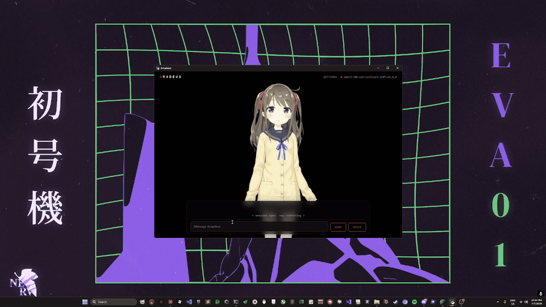
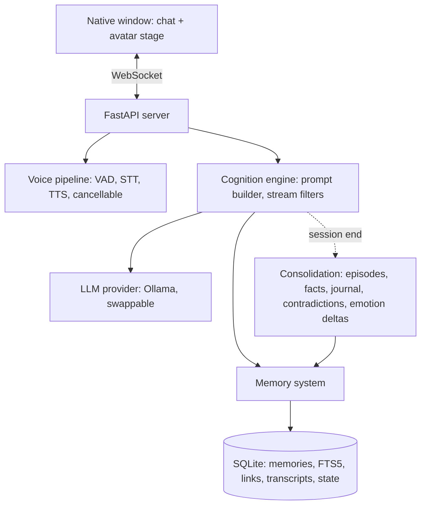

# Amadeus

A local-first AI companion engine: persistent memory, an emotional state
that drifts over weeks, real-time voice conversation you can interrupt
mid-sentence, and a Live2D avatar, running entirely on your own hardware
in a native desktop window. Nothing leaves your machine.

This started as a personal fan project inspired by the Amadeus system
from *Steins;Gate 0*, with the anime treated as a functional spec. It
ended up somewhere more general: the character is data. A markdown file
defines her name and personality, one config line each picks the voice,
the brain, and the face. The defaults give you Amadeus. Ten minutes of
editing gives you someone else. No assets from the show are included.

> She remembers what you told her last Tuesday. She writes a short
> journal entry after each conversation. Her trust accumulates on a
> 60-day half-life, and past a threshold, her avatar starts to blush.


 

## What it does

- **Persistent memory.** Seven memory types in one SQLite file. After
  each session an LLM pass mines the transcript into durable memories,
  links facts to the episodes they came from, strengthens near-duplicates
  instead of storing them twice, and flags contradictions instead of
  silently overwriting, so she can say "you told me differently before."
- **Hybrid retrieval.** Candidates are scored on vector similarity, BM25
  keyword match, recency decay, and stored importance. The weights are
  config, and every result exposes its per-channel score breakdown
  through a built-in `/recall` debugger.
- **Emotional state.** Six traits with homeostatic decay at different
  speeds. Mood resets within a day; trust takes about sixty days. The
  state reaches the prompt as prose style hints, never numbers, and sets
  the avatar's resting expression.
- **Voice.** Browser mic capture (hardware echo cancellation) streams
  16 kHz audio to the server. Silero VAD segments utterances,
  faster-whisper transcribes, and Kokoro speaks the reply sentence by
  sentence while the LLM is still writing. Talk over her and generation
  cancels within about 400 ms; the cut-off reply is archived as
  interrupted, so she knows it happened.
- **Avatar.** Any Cubism 4 Live2D model you have rights to, driven by
  layered animation: breathing, randomized blinking, gaze drift, lip sync
  from the actual TTS audio, physics reacting to head motion. The LLM
  picks facial expressions itself through invisible inline tags that a
  stream filter turns into fade events.
- **Character as data, editable in-app.** `persona.md` defines who she
  is; the window title and UI follow it. A settings panel in the UI edits
  the character, the LLM (with a dropdown of your installed Ollama
  models), the voice, and every tuning knob, and character edits apply
  from the next message. The full guide, including defaults for every
  setting, is [docs/CUSTOMIZATION.md](docs/CUSTOMIZATION.md).
- **Local everything.** Ollama for the LLM, local models for STT and TTS,
  SQLite for storage, pywebview for the window. Works offline after
  setup.

## Architecture



Design decisions and their reasoning live in
[docs/adr/](docs/adr/0001-tech-stack.md); a subsystem-by-subsystem tour
is in [docs/HOW_IT_WORKS.md](docs/HOW_IT_WORKS.md). The two most debated
calls, briefly: vector search is brute-force numpy cosine because at
personal scale it costs single-digit milliseconds and zero native
dependencies, and audio capture lives in the browser because
`getUserMedia` provides hardware echo cancellation, without which
barge-in over speakers doesn't work at all.

## Stack

Python 3.11+, FastAPI, SQLite with FTS5, Ollama
(`qwen3:30b-a3b-instruct-2507-q4_K_M` by default), faster-whisper, Kokoro
TTS, Silero VAD, a vanilla JS frontend, pixi-live2d-display, pywebview.
100 tests; none needs a GPU or a running model server, thanks to a
deterministic fallback embedder and fake providers.

## Quickstart

Requires [Ollama](https://ollama.com) and Python 3.11+. The default model
wants about 20 GB of VRAM; smaller options are in the customization
guide.

One command: `.\setup.ps1` on Windows, `bash setup.sh` on Linux/macOS.
It creates the venv, installs everything, pulls the models, and is safe
to re-run. The manual version:

```bash
python -m venv .venv && source .venv/bin/activate   # Windows: .venv\Scripts\Activate.ps1
pip install -e ".[dev,voice]"
ollama pull qwen3:30b-a3b-instruct-2507-q4_K_M
ollama pull nomic-embed-text
python -m amadeus voice-setup     # one-time local model downloads
python -m amadeus                 # opens a native desktop window
```

For the avatar, run `python -m amadeus avatar-setup` and add any Cubism 4
model you have rights to. None is bundled; the stage stays black until
you install one. Changing the character, voice, models, and every other
knob: [docs/CUSTOMIZATION.md](docs/CUSTOMIZATION.md).

## Honest limitations

- A 30B local model confabulates more than a frontier API model.
  Closed-world prompt framing ("these entries are your ONLY knowledge of
  this person") cut it down a lot, but not to zero.
- Lip sync is energy-based, not phoneme-based. The rhythm matches; the
  mouth shapes are approximate.
- Whisper defaults to CPU on Windows because the CUDA dependency chain
  for CTranslate2 on Python 3.14 is fragile. Transcribing a sentence
  takes about a second, which is usable but not instant.
- Retrieval weights are hand-tuned defaults, not learned. The `/recall`
  debugger exists because they will need adjustment per user.

## Things that went wrong (selected)

The parts that taught me the most were failures. HuggingFace's `hf_xet`
download accelerator hung silently on my network, so model downloads
moved to a plain HTTPS fetcher. A schema migration flagged every
historical session as needing consolidation, which queued dozens of 30B
LLM jobs at startup and froze the first message for minutes; startup
recovery is now capped at two sessions. The default LLM turned out to be
a hybrid reasoning model whose hidden monologue first added a minute of
latency and then, when suppression flags were ignored, leaked straight
into her spoken replies; the fix was switching to a non-thinking variant,
now the default. The Live2D framework's update cycle restores a saved
parameter snapshot every frame, erasing externally set values, so
animation had to be injected through the motion manager hook. And after
all of that, the avatar stood perfectly still because Windows'
reduced-motion accessibility setting was on and the code honored it.

## Development notes

No assets from the show are included or used. The avatar system loads any
Cubism 4 model the user has rights to; none is bundled.

## License

MIT. Live2D Cubism Core is downloaded from Live2D's official CDN at setup
time under its own license and is not redistributed here.
